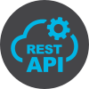

  

  <table align="center">
    <tr>
      <td>
        
      </td>
      <td rowspan="2">
        
      </td>
      <td>
        
      </td>
    </tr>
    <tr>
      <td>
        
      </td>
      <td>
        
      </td>
    </tr>
  </table>
  

  
  <h2>About Me</h2>
  

    
  

  
<h2>Tools I Have Used and Learned</h2>

<h5>Python</h5>

<table align="center">
<tr>
<td align="center" width="70">Python</td>
<td align="center" width="70">Flask</td>
<td align="center" width="70">Numpy</td>
<td align="center" width="70">Pandas</td>
<td align="center" width="70">Discord.py</td>
<td align="center" width="70">Tkinter</td>
</tr>
</table>

<table align="center">
<tr>
<td align="center" width="70">PyQT</td>
<td align="center" width="70">Pygame</td>
<td align="center" width="70">Pyscript</td>
<td align="center" width="70">Jinja</td>
<td align="center" width="70">Requests</td>
<td align="center" width="70">BeautifulSoup</td>
</tr>
</table>

<table align="center">
<tr>
<td align="center" width="70">SQLAlchemy</td>
<td align="center" width="70">OpenPyXL</td>
<td align="center" width="70">NLTK</td>
<td align="center" width="70">PyCharm</td>
<td align="center" width="70">Anaconda</td>
<td align="center" width="70">Jupyter</td>
</tr>
</table>

<h5>Java</h5>

<table align="center">
<tr>
<td align="center" width="70">Java</td>
<td align="center" width="70">Kotlin</td>
<td align="center" width="70">Spring</td>
<td align="center" width="70">Gradle</td>
</tr>
</table>

<table align="center">
<tr>
<td align="center" width="70">Thymeleaf</td>
<td align="center" width="70">IntelliJ</td>
<td align="center" width="70">Eclipse</td>
</tr>
</table>

<h5>Javascript/Web</h5>

<table align="center">
<tr>
<td align="center" width="70">JavaScript</td>
<td align="center" width="70">CSS</td>
<td align="center" width="70">HTML</td>
<td align="center" width="70">P5.js</td>
<td align="center" width="70">WebStorm</td>
</tr>
</table>

<h5>Other Languages & Databases</h5>

<table align="center">
<tr>
<td align="center" width="70">VBA</td>
<td align="center" width="70">C</td>
<td align="center" width="70">LaTeX</td>
<td align="center" width="70">Markdown</td>
</tr>
</table>

<table align="center">
<tr>
<td align="center" width="70">SQL</td>
<td align="center" width="70">SQLite</td>
<td align="center" width="70">PostgreSQL</td>
<td align="center" width="70">MongoDB</td>
</tr>
</table>

<h5>Dev Tools & Platforms</h5>

<table align="center">
<tr>
<td align="center" width="70">Git</td>
<td align="center" width="70">GitHub</td>
<td align="center" width="70">Docker</td>
<td align="center" width="70">AWS</td>
<td align="center" width="70">VSCode</td>
</tr>
</table>

<table align="center">
<tr>
<td align="center" width="70">JetBrains</td>
<td align="center" width="70">Sublime</td>
<td align="center" width="70">GraphQL</td>
<td align="center" width="70">REST API</td>
<td align="center" width="70">Postman</td>
</tr>
</table>

<h5>Design & Media</h5>

<table align="center">
<tr>
<td align="center" width="70">GIMP</td>
<td align="center" width="70">Inkscape</td>
<td align="center" width="70">Photoshop</td>
<td align="center" width="70">Keynote</td>
<td align="center" width="70">PowerPoint</td>
</tr>
</table>
  

  

