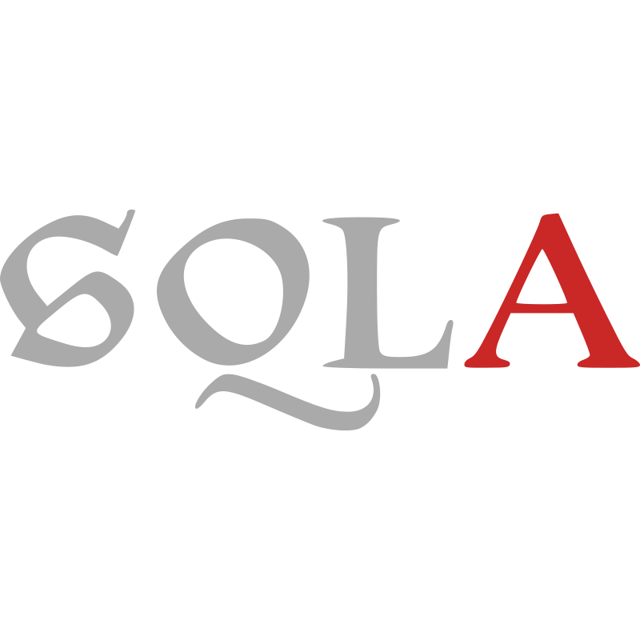

  

  <table align="center">
    <tr>
      <td>
        
      </td>
      <td rowspan="2">
        
      </td>
      <td>
        
      </td>
    </tr>
    <tr>
      <td>
        
      </td>
      <td>
        
      </td>
    </tr>
  </table>
  

  <h2>About Me</h2>
  

  <h2>Tools I Have Used and Learned</h2>
  

    
    
    
    
    
    
    
    
    
    
    
    
    
    
    
    
    
    
    
    
    
     
    
    
    
    
    
    
    
    
    
    
    
    
    
    
    
    
    
    
    
    
    
    
    
    
    
    
  

  

  

